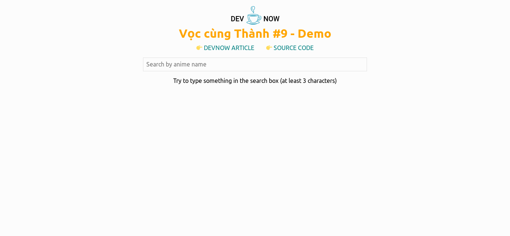

# Vọc cùng Thành #9 - Scale React app tốt hơn với TypeScript

## Giới thiệu



Đây là demo cho bài viết [Vọc cùng Thành #9 - Scale React app tốt hơn với TypeScript][post]

Demo link: https://vct-9.thanhnguyen.now.sh

## Yêu cầu

- [Git][git]
- [Node][node]

## Cài đặt

```bash
# Clone repo
git clone https://github.com/EGANY-Team/vct-9-scale-reactjs-app-better-with-typescript
cd vct-9-scale-reactjs-app-better-with-typescript

# Install packages
npm install

# Start dev server
npm start

# Build
npm run build
```

## Tài liệu tham khảo

- [create-react-app][create-react-app]
- [jikan-api][jikan]
- [typescript][ts]

[git]: https://git-scm.com/
[node]: https://nodejs.org
[post]: https://devnow.vn/?p=3108
[create-react-app]: https://github.com/facebook/create-react-app
[jikan]: https://jikan.docs.apiary.io
[ts]: https://www.typescriptlang.org/